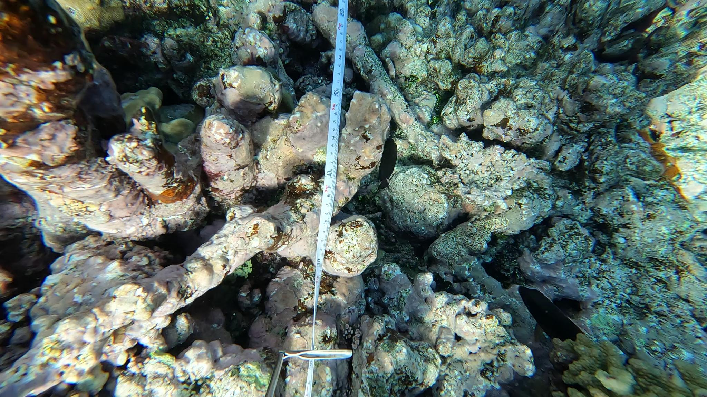
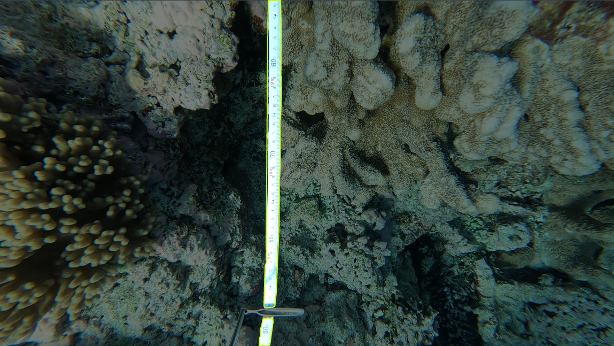
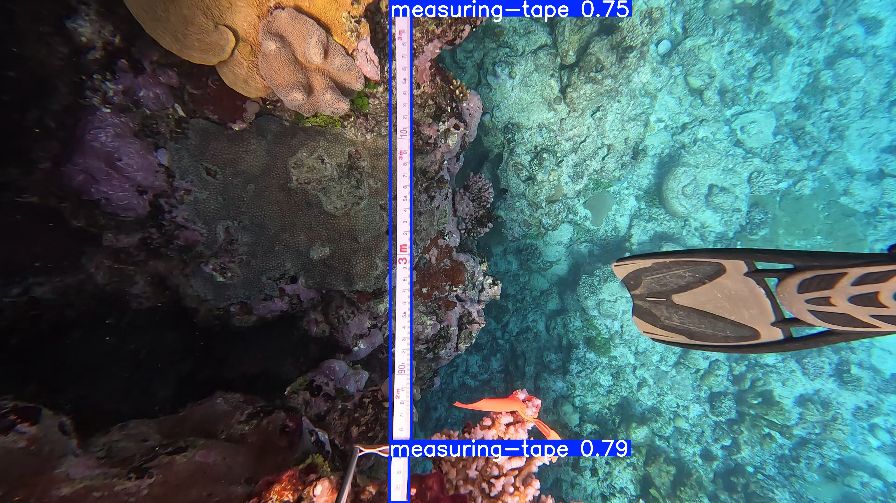
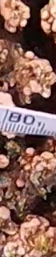
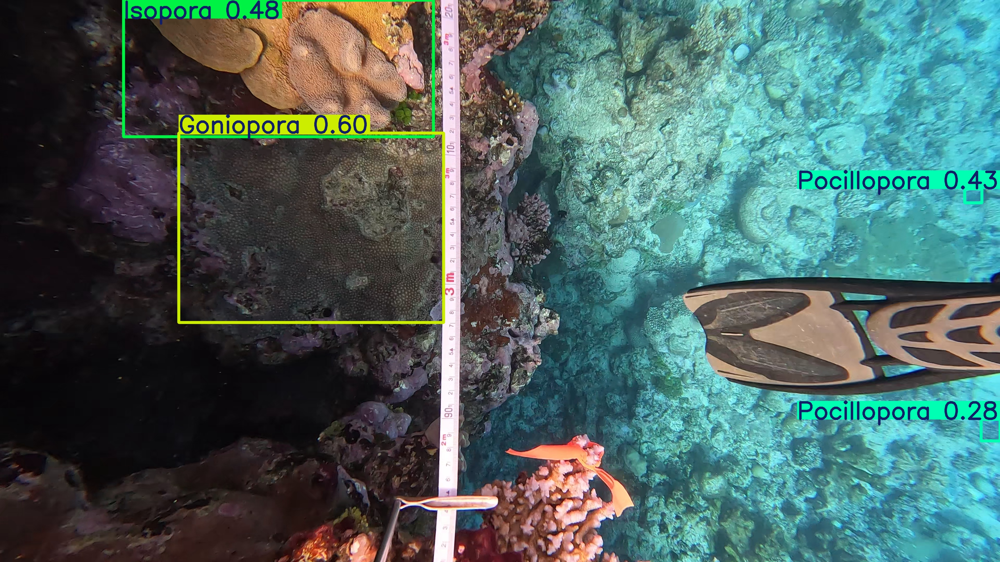
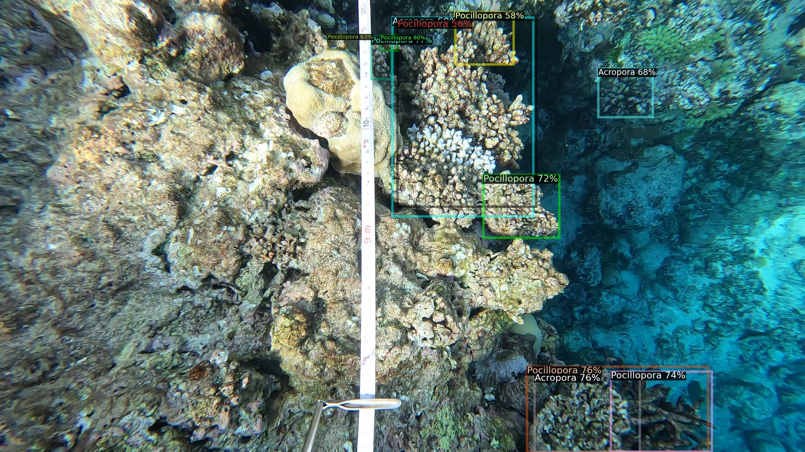

# 🌊 AI-Powered Coral Reef Assessment

## 📖 Table of Contents

1. **Introduction**  
   - 🌍 The Role of AI in Coral Reef Assessment  
2. **Project Overview**  
   - 🎯 Objective of the Study  
   - 🏗 Challenges in Manual Coral Identification  
3. **Frame Selection Process**  
   - 📏 Detecting Measurement Tape in Frames  
   - 🔢 Using OCR to Determine Distance  
4. **Coral Detection Model**  
   - 🏷 Manual Annotation of Coral Species  
   - 🤖 Training an AI Model for Automated Detection  
5. **Automation Potential**  
   - 🔄 Transitioning from Manual to AI-driven Analysis  
6. **Conclusion**  
   - 🚀 The Broad Applicability of AI in Scientific Research  
   - 🔮 Future Improvements and Applications  

---

## 1️⃣ Introduction

### 🌍 The Role of AI in Coral Reef Assessment

Artificial Intelligence (AI) has become increasingly accessible and can be leveraged to automate various tasks. In our project, AI is applied to estimate coral cover, a process that perfectly aligns with AI’s strengths in image recognition. Given that video-based monitoring systems are already in place, integrating AI allows for faster and more efficient processing. The vastness of the Great Barrier Reef requires a significant human effort to analyze videos manually. However, AI can streamline this process, automating tasks that would otherwise take countless hours.

---

## 2️⃣ Project Overview

### 🎯 Objective of the Study

Currently, analysts manually review videos from different locations across the Great Barrier Reef. Every 20 cm along the video, they identify and document the coral species present, ultimately calculating species distribution percentages. The goal of this project is to develop an automated pipeline, from data acquisition to the final estimation of coral species proportions.

### 🏗 Challenges in Manual Coral Identification

Manually labeling videos is a time-consuming process. Analysts must identify frames corresponding to each 20 cm mark, recognize the coral species, and input the data into a table. This process is challenging due to underwater conditions such as lighting variations and the movement of the measuring tape, which complicates detection. Our project aims to overcome these difficulties by automating the process with AI.

---

## 3️⃣ Frame Selection Process

### 📏 Detecting Measurement Tape in Frames

The first step is to extract frames that correspond to each 20 cm mark in the videos. Below is an example of how these frames appear:  
📷  

To achieve this, we trained a detection model to locate only the measuring tape in each image. Using Roboflow, we manually labeled around a hundred images:  
📷  

We then exported our dataset in YOLO format and trained a YOLOv11 model. Thanks to the Ultralytics Python library, training the model was straightforward. The results were highly promising:  
📷  

### 🔢 Using OCR to Determine Distance

Next, we extract the numerical distance from the measurement tapes. For each frame, we isolate the central part of the detected tape and apply Optical Character Recognition (OCR). Our goal is to detect the numbers 0, 20, 40, 60, or 80, which indicate the desired frame locations.

We utilized the EasyOCR library, a powerful OCR tool in Python, particularly when using a GPU. The results were highly satisfactory:  
📷  

---

## 4️⃣ Coral Detection Model

### 🏷 Manual Annotation of Coral Species

A critical challenge was acquiring labeled coral images for training the detection model. Fortunately, we had access to a previously hand-labeled dataset from an old video, allowing us to bypass the tedious data-labeling process.
📷  

### 🤖 Training an AI Model for Automated Detection

To select the best model, we prioritized ease of use, pre-trained architectures (since we had limited data), and efficiency. We compared YOLOv11 (used earlier for measurement tape detection) with Detectron v2, developed by Meta.

Both models were trained on our dataset and delivered promising results:

🔹 **YOLOv11:**  
📷  

🔹 **Detectron v2:**  
📷  

To refine the accuracy of our models, additional training data is required, ensuring robust detection across all coral species.

---

## 5️⃣ Automation Potential

### 🔄 Transitioning from Manual to AI-driven Analysis

With the pipeline completed, a few refinements remain. The next step is developing a **user interface** to enable analysts to interact seamlessly with the system. Analysts will still manually review a small percentage of frames (<5%) where AI detection is uncertain.

For instance, when the measuring tape is unreadable, analysts will be prompted to manually locate the correct frame:  
📷  

This hybrid approach significantly reduces manual workload while ensuring data reliability.

---

## 6️⃣ Conclusion

### 🚀 The Broad Applicability of AI in Scientific Research

As demonstrated in this project, AI is a powerful tool for automating complex tasks, saving time and effort. AI’s adaptability extends across numerous fields, provided it is carefully implemented and monitored.

### 🔮 Future Improvements and Applications

The next steps include:
- Enhancing model accuracy with additional training data.
- Integrating all components into a **fully functional pipeline**.
- Developing a **graphical user interface (GUI)** for analysts.

This project lays the foundation for broader AI applications in environmental monitoring and conservation. 🌱🌎

---

🎉 **Thank you for reading!** If you have any questions, feel free to reach out. 🚀
